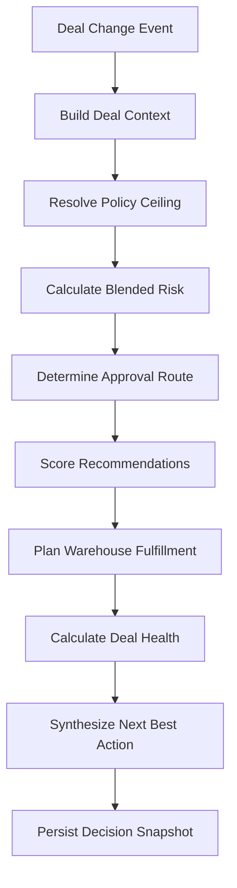
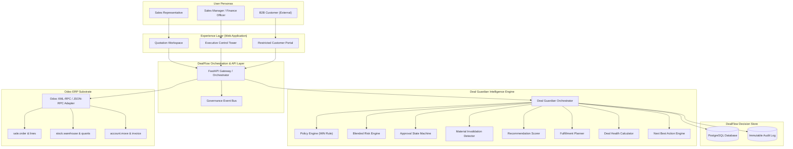

# DealFlow360

> **Intelligent, Self-Governing Sales Operations Platform for Odoo**

---

## One-Line Description

DealFlow360 is an intelligent, deterministic sales governance engine that sits between modern sales teams and Odoo ERP to continuously evaluate deal risk, automate policy compliance, plan multi-warehouse fulfillment, and govern live customer negotiations.

---

## The Problem

In enterprise and mid-market B2B commerce, closing a deal is rarely as simple as clicking "Quote to Invoice." High-value quotations are fraught with commercial and operational friction:

* **Uncontrolled Discounting**: Sales representatives frequently offer ad-hoc discounts that erode profit margins without visibility into category ceilings or customer tier thresholds.
* **Approval Bottlenecks**: High-risk quotes either stall in manual email approval chains for days or slip through without required executive sign-offs.
* **Margin Blind Spots**: Sales reps maximize deal gross value while inadvertently selling low-margin or loss-making configurations.
* **Inventory Reality vs. Quoting**: Sales promises delivery without checking real-time warehouse availability, causing delivery failures or expensive multi-facility splits.
* **Negotiation Drift (The Broken Promise)**: After a quote is approved by Finance, a customer negotiates a higher discount on the portal. In traditional systems, sales reps accept the counteroffer without re-approval, exposing the business to unapproved losses.
* **Stalled Pipeline & Anomalies**: Deals linger without activity or contain statistical pricing anomalies that management discovers only at month-end.

---

## Our Solution

DealFlow360 bridges the gap between commercial decision-making and ERP transaction execution. It operates on a strict architectural doctrine:

> **"Odoo owns transactions. DealFlow owns decisions. Deal Guardian governs deal state."**

```
┌────────────────────────────────────────────────────────┐
│                   DEALFLOW360                          │
│               "WHAT SHOULD HAPPEN?"                    │
│   Governance • Blended Risk • Automated Approvals      │
│   Recommendations • Fulfillment Split • Health         │
└───────────────────────────┬────────────────────────────┘
                            │
                            ▼
┌────────────────────────────────────────────────────────┐
│                    ODOO ERP                            │
│                 "MAKE IT HAPPEN."                      │
│   Partners • Products • Sales Orders • Stock Quants    │
│   Pickings • Invoices • Subscriptions • Payments       │
└────────────────────────────────────────────────────────┘
```

### Separation of Responsibilities

* **Odoo (Transactional Source of Truth)**:
  * Customer and partner records (`res.partner`)
  * Product master catalog and costs (`product.template`, `product.product`)
  * Quotation and sales order booking (`sale.order`, `sale.order.line`)
  * Inventory tracking and stock levels (`stock.warehouse`, `stock.quant`, `stock.picking`)
  * Subscriptions, invoicing, accounting, and ERP security
* **DealFlow (Intelligence & Decision Layer)**:
  * Policy resolution against customer tier and category ceilings
  * Blended multi-factor risk assessment
  * Multi-tier approval routing and state machine enforcement
  * Accretive cross-sell and upsell recommendation scoring
  * Greedy multi-warehouse fulfillment planning
  * Real-time negotiation drift and material change detection
  * Deal health monitoring and next-best-action synthesis

---

## Deal Guardian

The **Deal Guardian** is the core differentiator of DealFlow360. Rather than an opaque AI chatbot or a passive dashboard widget, Deal Guardian is a continuous, deterministic governance engine. Whenever any material change occurs on a deal, the Guardian runs its deterministic evaluation pipeline:



### Core Tenets of the Deal Guardian
1. **Deterministic**: Given the same quote lines, customer tier, and warehouse stock, the Guardian always produces the exact same decision and risk score.
2. **Explainable**: Every point of risk and every policy breach answers: *What happened? How much did it contribute? Why does it matter?*
3. **Continuous**: The Guardian re-evaluates automatically whenever line items, discounts, customer counteroffers, or warehouse stocks change.
4. **Approval Safety**: It preserves an immutable approved baseline to detect commercial drift and immediately invalidate compromised approvals.

---

## Killer Scenario: The Counteroffer Trap

The defining moment for DealFlow360 solves one of the biggest leaks in B2B sales:

```
[ Sales Rep Quotes 18% Setup Discount ]
                   ↓
[ Guardian Flags Risk: 61/100 (HIGH) — Requires Finance Approval ]
                   ↓
[ Finance Reviews & Approves Strategic Concession ]
                   ↓
[ Deal Guardian Stores Approved Baseline: 18% ]
                   ↓
[ Customer Opens Portal & Counteroffers: 22% Discount ]
                   ↓
==================== THE KILLER MOMENT ====================
[ MaterialChangeDetector compares 22% against 18% Baseline ]
                   ↓
[ Deal Guardian INVALIDATES Previous Approval ]
                   ↓
[ Blended Risk Recalculated — State Resets to PENDING_FINANCE ]
                   ↓
[ Next Best Action: "Executive Re-Approval Required" ]
```

In standard ERP systems, a sales rep could quietly accept the customer's 22% counteroffer because the order was already marked "Approved." In DealFlow360, **customer negotiation creates a proposal, not an ERP transaction**. Stale approvals are automatically revoked before transactional commitment.

---

## Architecture



---

## Role-Based Experience

| Role | Primary Interface | Capabilities & Views | Restrictions |
| :--- | :--- | :--- | :--- |
| **Sales Representative** | Quotation Workspace | Live quotation builder, instant margin visibility, Deal Guardian risk cards, accretive upsell recommendations, warehouse allocation maps, guided Next Best Action. | Cannot bypass approval thresholds or override discount policies. |
| **Sales Manager & Finance** | Control Tower & Approval Queue | Executive portfolio risk overview, pending approval queue with one-click approve/reject/return, risk factor breakdowns, material change diffs, deal velocity/health monitoring. | Standard separation of duties between Manager and Finance tiers. |
| **B2B Customer** | Restricted Customer Portal | Clean quote viewer, line-level discount and quantity counteroffer submission, delivery confirmation, and order sign-off. | **Strictly restricted**: No access to internal margins, cost units, risk scores, or policy rules. |

---

## Core Features

* **GOV-01: Policy Resolution Engine**: Enforces strict ceiling precedence: $\text{Effective Ceiling} = \min(\text{Customer Tier Limit}, \text{Category Limit})$. Explains exact compliance or excess.
* **GOV-02: Blended Risk Engine**: Calculates a 0–100 risk score combining discount excess, projected margin erosion, multi-facility warehouse split penalties, and stalled quote delays.
* **GOV-03: Approval State Machine**: Implements strict FSM transitions across `DRAFT`, `PENDING_MANAGER`, `PENDING_FINANCE`, `APPROVED`, `REJECTED`, and `INVALIDATED`.
* **GOV-04: Material Change Detection**: Detects commercial deterioration against the approved baseline (discount increase, margin drop, quantity reduction) and automatically invalidates compromised approvals.
* **GOV-05: Deal Guardian Orchestrator**: Executes the complete governance pipeline in sub-millisecond time and returns a consolidated decision snapshot.
* **GOV-06: Recommendation Engine**: Deterministic scoring based on co-purchase frequency, margin attractiveness, and promotional priority: $\text{Score} = (0.5 \times \text{CoPurchase}) + (0.3 \times \text{Margin}) + (0.2 \times \text{Promo})$. Negative-margin products are excluded.
* **GOV-07: Fulfillment Planner**: Greedy multi-warehouse stock allocator: Primary warehouse first $\rightarrow$ Secondary warehouse next $\rightarrow$ Backorder. Preserves the conservation invariant: $\text{Allocated} + \text{Backorder} \equiv \text{Requested}$.
* **GOV-08: Deal Health & Anomaly Detector**: Flags stalled opportunities ($>5$ days inactive) and statistical discount anomalies ($>2\sigma$ above sales rep historical average).
* **Next Best Action (NBA)**: Deterministically synthesizes the single highest-priority operational step for the rep (`RE_APPROVAL_REQUIRED`, `FINANCE_APPROVAL_REQUIRED`, `FULFILLMENT_SPLIT_REQUIRED`, `CONFIRM_QUOTATION`).
* **Governance Event Bus**: Decoupled event bus with built-in idempotency controls ensuring repeated events never create duplicate approval requests or invalidations.

---

## Technology Stack

The project relies exclusively on established, modern enterprise technologies:

* **Backend & Governance**: Python 3.11, FastAPI, Pydantic v2
* **Persistence & Migrations**: PostgreSQL, SQLAlchemy 2.0, Alembic
* **ERP Substrate**: Odoo 17 / 18 Community or Enterprise (Sales, Inventory, Invoicing)
* **Integration Protocols**: Python XML-RPC / JSON-RPC
* **Frontend**: React, TypeScript, Next.js / Vite
* **Testing & Quality**: pytest, pytest-cov

---

## Repository Structure

```
c:/Hackathon/odoo/
├── backend/
│   ├── app/
│   │   ├── governance/               # Agent 3: Deal Governance / Deal Guardian
│   │   │   ├── __init__.py
│   │   │   ├── context.py            # Normalized Contract 1 domain models
│   │   │   ├── interfaces.py         # Decoupled repository & provider protocols
│   │   │   ├── events.py             # Idempotent governance event bus
│   │   │   ├── guardian.py           # Master Deal Guardian orchestrator & NBA
│   │   │   ├── policy/               # GOV-01: Policy resolution engine
│   │   │   ├── risk/                 # GOV-02: Blended risk calculation & explanations
│   │   │   ├── approval/             # GOV-03 & GOV-04: Approval FSM & Invalidation
│   │   │   ├── negotiation/          # Negotiation counteroffer evaluator
│   │   │   ├── recommendation/       # GOV-06: Accretive product recommendation
│   │   │   ├── fulfillment/          # GOV-07: Greedy multi-warehouse planner
│   │   │   ├── health/               # GOV-08: Deal health & anomaly detection
│   │   │   └── fixtures/             # Mock deal contexts & Contract 1 sample data
│   │   ├── models/                   # Agent 1: SQLAlchemy database models
│   │   ├── api/                      # Agent 1 / Agent 3: FastAPI REST endpoints
│   │   └── odoo/                     # Agent 2: Odoo ERP RPC integration adapters
│   └── tests/                        # Full test suite (Unit, Invariant, Killer Demo)
├── frontend/                         # Agent 4: React / Next.js User Interfaces
├── DealFlow360_Master_Strategy.md    # Complete product and architecture specification
├── DealFlow360_Team_Task_Ownership.md# Workstream boundaries and rules
├── README.md                         # Project overview and architecture guide
└── TASKS.md                          # Master team execution checklist
```

---

## Development Philosophy

1. **Odoo owns transactions; DealFlow owns decisions.** Never duplicate customer, product, or inventory data in the decision layer.
2. **Business policy decides; Deal Guardian explains.** AI/LLMs must never override commercial policies or invent risk scores.
3. **Deterministic & Reproducible.** Given the same inputs, the decision engine will always output the exact same score, approval route, and fulfillment plan.
4. **Decoupled by Design.** The governance layer operates purely on normalized typed domain models, making it testable and resilient without database or network connections.
5. **Customer proposals are not transactions.** Customer portal counteroffers create a proposal for governance review and must never directly mutate approved ERP state.

---

## 5-Minute Golden Demo Path

1. **Sales Rep Quotes**: Sales rep selects Gold customer Acme Corp, adds 10 Enterprise Laptops (12% discount) and Architecture Setup Service (18% discount).
2. **Guardian Evaluates**: Guardian instantly calculates Services category ceiling is 10% $\rightarrow$ flags 8% violation $\rightarrow$ computes Blended Risk = **61/100 (HIGH)** $\rightarrow$ routes deal to `PENDING_FINANCE`.
3. **Accretive Recommendation**: Guardian recommends adding a Thunderbolt Docking Station (+₹13,000 margin) to offset the concession.
4. **Fulfillment Split**: Multi-warehouse planner reveals 9 units in Main Warehouse and 1 unit in East Depot; rep accepts suggested split.
5. **Finance Sign-Off**: Finance Officer approves the strategic quote in the Control Tower; approved baseline is preserved (18%).
6. **Customer Negotiation**: Customer opens portal and counters with a 22% discount on Setup Service.
7. **The Killer Moment**: Guardian detects material change against the 18% baseline $\rightarrow$ revokes approval to `INVALIDATED` $\rightarrow$ recalculates risk $\rightarrow$ resets stage to `PENDING_FINANCE` $\rightarrow$ Next Best Action becomes `RE_APPROVAL_REQUIRED`.
8. **Final Booking**: Executive re-approves counteroffer $\rightarrow$ order confirms in Odoo $\rightarrow$ delivery pickings and billing records generate automatically $\rightarrow$ full immutable audit timeline displayed.

---

## Team Ownership

| Workstream | Owner | Core Deliverables |
| :--- | :--- | :--- |
| **Agent 1** | Database Architect | PostgreSQL schema, SQLAlchemy models, Alembic migrations, database repositories, seed scripts, audit trail persistence. |
| **Agent 2** | Odoo Integration Engineer | Odoo RPC client, sale.order / stock / account adapters, Odoo custom addon, ERP transaction execution. |
| **Agent 3** | Deal Governance Engineer | Deal Context, Policy Engine, Blended Risk, Approval FSM, Invalidation Detector, Recommendations, Fulfillment Planner, Deal Health, Deal Guardian. |
| **Agent 4** | Frontend / UX Engineer | Sales Rep Workspace, Manager Control Tower, Approval Queue, Customer Negotiation Portal, Deal Guardian visual cards. |

---

## Development Status

Implementation is being developed in parallel across four dedicated workstreams. Core governance and decision algorithms are established and verified via offline unit testing; backend persistence, Odoo ERP connectors, and web UI integration are in active assembly.

---

## Running the Project

> Setup instructions will be finalized as integration progresses across all four workstreams.

### Running Governance Tests Standalone
The governance engine is fully testable offline without PostgreSQL, Odoo, or external services:

```bash
# Run all governance and invariant tests
python -m pytest backend/tests -v

# Run tests with code coverage
python -m pytest backend/tests --cov=backend/app/governance --cov-report=term-missing
```

---

## Contribution & Team Workflow

* **Respect Ownership**: Never modify another agent's schema, Odoo models, or governance algorithms without coordination.
* **Freeze Shared Contracts**: Any change to `DealContext`, `GuardianEvaluationResult`, or API DTOs requires mutual sign-off.
* **Keep Logic Out of Frontend**: The web UI must render decisions generated by Deal Guardian and never implement business or pricing rules.

---

## License

Developed for the **Odoo Finale 24-Hour Hackathon**. All rights reserved by the DealFlow360 team.
