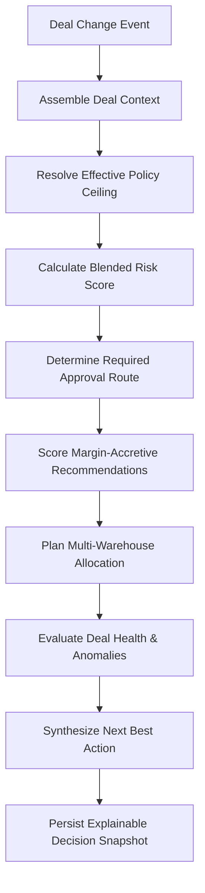
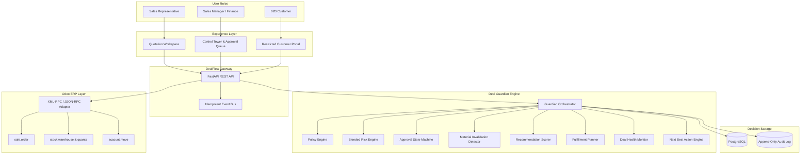

# DealFlow360

> **Intelligent, Self-Governing Sales Operations Platform for Odoo**  
> *Built for the Odoo Finale Hackathon*

---

## What is DealFlow360?

DealFlow360 is a sales governance layer built on top of Odoo ERP. It gives sales teams real-time deal risk scoring, automated discount policy enforcement, multi-warehouse fulfillment planning, and intelligent negotiation governance—while keeping Odoo as the single transactional source of truth.

---

## Why We Built This

Closing high-value B2B deals in standard ERP systems is often messy and error-prone:

* **Margin Erosion from Rogue Discounting**: Reps give steep, ad-hoc discounts to hit revenue targets without knowing category ceilings or customer tier limits.
* **Approval Bottlenecks**: Quotes get stuck in email threads for days waiting for sign-offs, or slip through without required executive reviews.
* **Quoting Without Inventory Reality**: Reps promise delivery dates without checking stock across regional warehouses, leading to surprise split shipments or backorders.
* **The Counteroffer Trap (Negotiation Drift)**: A rep gets a 18% discount approved by Finance. The customer counters asking for 22% on the portal. In typical ERP setups, the rep can quietly accept that counteroffer because the quote was already marked "Approved"—silently wiping out deal margins.
* **Stalled Pipeline Blind Spots**: Deals sit idle for weeks or contain pricing anomalies that managers only catch at the end of the quarter.

DealFlow360 eliminates these blind spots by governing the commercial decision-making lifecycle before anything is permanently committed to Odoo.

---

## How It Works: The Core Doctrine

We designed DealFlow360 around a strict rule:

> **"Odoo owns transactions. DealFlow owns decisions. Deal Guardian governs deal state."**

```
┌────────────────────────────────────────────────────────┐
│                   DEALFLOW360                          │
│               "WHAT SHOULD HAPPEN?"                    │
│   Policy Checks • Blended Risk • Approval State Machine│
│   Cross-Sell Suggestions • Warehouse Split • Deal Health│
└───────────────────────────┬────────────────────────────┘
                            │
                            ▼
┌────────────────────────────────────────────────────────┐
│                    ODOO ERP                            │
│                 "MAKE IT HAPPEN."                      │
│   Customers • Products & Costs • Sales Orders          │
│   Stock Quants & Pickings • Invoices & Payments        │
└────────────────────────────────────────────────────────┘
```

### Clear Division of Responsibilities

* **Odoo (Transactional Core)**:
  * Customer & partner master records (`res.partner`)
  * Product master catalog, standard costs, and pricelists (`product.product`)
  * Quotation booking and formal sales orders (`sale.order`)
  * Inventory levels and warehouse pickings (`stock.warehouse`, `stock.quant`)
  * Invoicing, accounting entries, and subscriptions
* **DealFlow360 (Decision & Intelligence Layer)**:
  * Resolves discount policies against customer tiers and category caps
  * Computes a 0–100 blended risk score across discounts, margins, delivery splits, and deal staleness
  * Manages multi-tier approval state transitions (Draft → Pending Manager → Pending Finance → Approved)
  * Ranks accretive recommendations to offset granted discounts
  * Solves multi-warehouse inventory allocation
  * Detects negotiation drift and revokes compromised approvals
  * Synthesizes the single Next Best Action for the rep

---

## Deal Guardian: Deterministic Governance

The heart of our solution is the **Deal Guardian**. We intentionally avoided using black-box LLMs for financial risk and approval gating. Enterprise finance requires reproducible, auditable math.

Whenever a quote is modified, Deal Guardian runs through a continuous, deterministic evaluation pipeline:



### Key Principles of the Guardian
1. **Deterministic**: Same quote lines, customer tier, and warehouse stocks always produce the exact same score and decision.
2. **Explainable**: Every risk point answers three questions: *What triggered it? How much did it contribute? Why does it matter?*
3. **Continuous**: Re-evaluates instantly as line items, quantities, discounts, or stock levels change.
4. **Approval Safety**: Maintains an immutable approved baseline so any commercial deterioration is immediately caught.

---

## The Killer Scenario: Catching the Counteroffer Trap

Here is the exact workflow that makes DealFlow360 invaluable:

```
1. Sales Rep quotes 18% discount on Cloud Architecture Setup (Category cap: 10%)
   ↓
2. Deal Guardian flags 8% policy violation → Risk jumps to 61/100 (HIGH)
   ↓
3. Routed to Finance Officer in Control Tower → Approved as a strategic concession
   ↓
4. Deal Guardian captures an immutable Approved Baseline: 18%
   ↓
5. Customer opens restricted portal and counters with a 22% discount request
   ↓
==================== THE CRITICAL MOMENT ====================
6. Deal Guardian compares 22% against the 18% Approved Baseline
   ↓
7. Material change detected → Previous approval is instantly INVALIDATED
   ↓
8. Blended risk recalculates → Deal resets to PENDING_FINANCE
   ↓
9. Next Best Action updates: "Executive Re-Approval Required"
```

In standard ERP workflows, this discount increase would easily slip through unnoticed. DealFlow360 treats customer negotiations as proposals, ensuring no unapproved terms can ever be booked into Odoo.

---

## System Architecture



---

## Role-Based Experience

| Role | Workspace | What They See & Do | Security Boundaries |
| :--- | :--- | :--- | :--- |
| **Sales Rep** | Quotation Workspace | Live quotation builder, real-time margin calculations, Deal Guardian risk cards, accretive product suggestions, warehouse allocation maps, guided Next Best Action. | Cannot bypass approval thresholds or override discount policies. |
| **Manager & Finance** | Control Tower | Portfolio-wide risk overview, pending approval queue with one-click actions, risk factor breakdowns, side-by-side baseline vs counteroffer diff viewer, deal velocity metrics. | Strict separation of duties between Manager and Finance tiers. |
| **B2B Customer** | Customer Portal | Clean quote viewer, line-level discount and quantity counteroffer inputs, commentary box, order confirmation. | **Zero Data Leakage**: Internal margins, unit costs, risk scores, and policy rules are completely inaccessible. |

---

## Core Capabilities

* **Policy Resolution Engine**: Computes effective ceiling using the minimum rule: $\text{Ceiling} = \min(\text{Customer Tier Limit}, \text{Category Limit})$. Generates clear reason codes for any excess.
* **Blended Risk Engine**: Evaluates discount excess, gross margin erosion, multi-warehouse split penalties, and quote delay into a clean 0–100 score with severity categories (`LOW`, `MEDIUM`, `HIGH`, `CRITICAL`).
* **Approval State Machine**: Enforces strict transitions across `DRAFT`, `PENDING_MANAGER`, `PENDING_FINANCE`, `APPROVED`, `REJECTED`, and `INVALIDATED`.
* **Material Change Detection**: Compares incoming proposals against the approved baseline. Flags discount increases, margin degradation, or commercial alterations while ignoring cosmetic edits.
* **Accretive Recommendations**: Suggests complementary products using a deterministic formula combining co-purchase affinity, margin attractiveness, and promotional priority. Never recommends negative-margin items.
* **Multi-Warehouse Fulfillment**: Greedily allocates available inventory from primary facility first, secondary depot next, and flags remaining balances as backorders while enforcing strict quantity conservation.
* **Deal Health & Anomaly Detection**: Highlights stalled quotes (>5 days inactive) and statistical discount outliers (>2 standard deviations above rep historical average).
* **Next Best Action (NBA)**: Synthesizes competing operational needs into one clear, prioritized next step for the sales representative.

---

## Tech Stack

* **Backend & Intelligence**: Python 3.11, FastAPI, Pydantic v2
* **Persistence & Migrations**: PostgreSQL, SQLAlchemy 2.0, Alembic
* **ERP Integration**: Odoo 17 / 18 Community/Enterprise via XML-RPC / JSON-RPC
* **Frontend**: React, TypeScript, Tailwind CSS
* **Testing**: pytest, pytest-cov

---

## Our Engineering Philosophy

1. **Odoo is the ERP; DealFlow is the brain.** We never duplicate customer records, product catalogs, or invoices inside DealFlow. Odoo remains the definitive transactional ledger.
2. **Determinism over hallucinations.** Pricing, margin thresholds, and approval routings must be 100% reproducible and mathematically explainable.
3. **Decoupled domain design.** The governance core operates on normalized data contracts (`DealContext`), making it fully testable without requiring live database or network connections.
4. **Proposals are not bookings.** Customer portal negotiations never directly mutate approved ERP orders—they create proposals that must clear governance.

---

## Team & Workstream Ownership

Our four-person engineering team divided responsibilities with strict interface boundaries:

| Member | Role | Primary Responsibility |
| :--- | :--- | :--- |
| **Person 1** | Database Architect | PostgreSQL schema, SQLAlchemy models, Alembic migrations, database repositories, seed scripts, audit persistence. |
| **Person 2** | Odoo Integration Engineer | Odoo RPC client, `sale.order` / `stock` / `account` adapters, custom Odoo addon, transaction execution. |
| **Person 3** | Deal Governance Engineer | Deal Context, Policy Engine, Blended Risk, Approval FSM, Invalidation Detector, Recommendations, Fulfillment, Health, Deal Guardian. |
| **Person 4** | Frontend / UX Engineer | Sales Rep Workspace, Manager Control Tower, Approval Queue, Customer Negotiation Portal, Deal Guardian UI components. |

---

## Running the Platform

### 1. Run Backend Server (FastAPI Decision Engine Gateway)
```bash
# Option A: Dedicated backend runner
python run_backend.py

# Option B: Direct uvicorn module
python -m uvicorn backend.app.main:app --host 127.0.0.1 --port 8000 --reload

# Option C: Windows batch file
.\run_backend.bat

# Option D: Via npm
npm run backend
```
* Interactive API Documentation (Swagger UI): `http://127.0.0.1:8000/docs`
* Health Check: `http://127.0.0.1:8000/health`

### 2. Run Frontend Web App (React + Vite)
```bash
cd frontend
npm run dev
# Or from root:
npm run dev
```
* Web Application: `http://localhost:5173`

### 3. Run Everything Together
```bash
python run_local.py
```

---

## Testing & Verification

The core governance algorithms are fully covered by automated tests that run completely offline without external database or Odoo dependencies:

```bash
# Run all governance, policy, risk, and invariant tests
python -m pytest backend/tests -v

# Run tests with coverage report
python -m pytest backend/tests --cov=backend/app/governance --cov-report=term-missing
```

---

## Team Workflow & Interface Rules

* **Clear Ownership**: Each person works strictly within their assigned domain. Changes to another person's models or code are coordinated through agreed-upon interfaces.
* **Contract-First Integration**: Shared data models (`DealContext`, `GuardianEvaluationResult`) are frozen before connecting frontend, backend, and ERP services.
* **Logic-Free Frontend**: The UI strictly renders decision states provided by the Deal Guardian and never embeds ad-hoc pricing or approval rules.

---

## License & Attribution

Developed for the **Odoo Finale Hackathon**. Created by Team 421.
