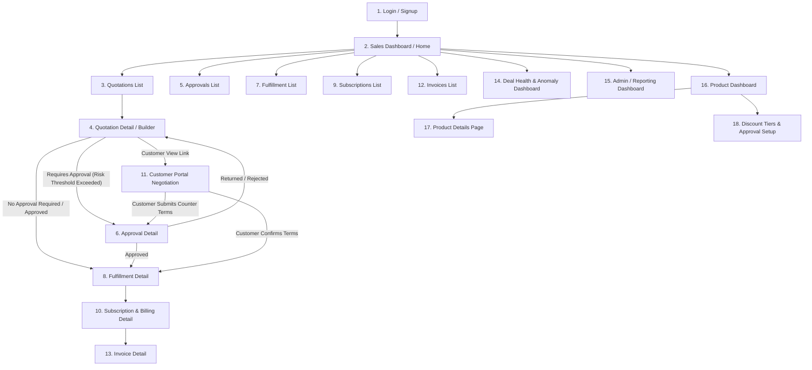
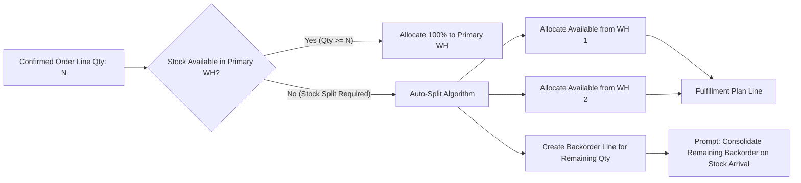
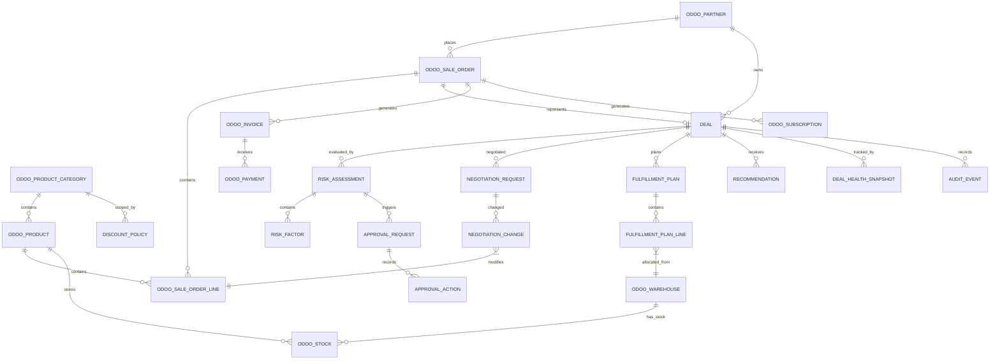

# DealFlow360: End-to-End Product Flow & Technical Architecture Analysis

## 1. Executive Summary & Vision

**DealFlow360** is an intelligent, self-governing B2B Sales Operations Platform designed to bridge the operational gap between standard CRM quotation systems and backend ERP fulfillment engines. 

Traditional B2B sales tools suffer from severe fragmentation:
1. **Unmonitored Discount Leakage**: Sales reps bypass pricing discipline by giving line-item discounts that look fine individually but destroy margins overall.
2. **Static & Siloed Quotations**: Quotes are static PDFs sent via email, creating slow, out-of-band negotiations.
3. **Inventory Blindness**: Reps promise stock that isn't available in a single warehouse, resulting in delayed fulfillment and broken delivery dates.
4. **Subscription-Hardware Billing Friction**: Mixing recurring services with one-time hardware causes manual billing reconciliation nightmares.
5. **Stalled Deal Inertia**: Sales managers only find out deals are stuck after momentum is lost.

DealFlow360 solves these problems by providing an automated, real-time, self-governing engine that enforces pricing rules, auto-splits fulfillment across warehouses, reconciles hybrid billing, facilitates portal-based customer negotiation, and monitors deal health continuously.

---

## 2. Comprehensive Screen-by-Screen Workflow Analysis

The wireframe map (`DealFlow360 - End to End Product Flow 24 hours oxp.excalidraw.png`) details **18 interconnected views** spanning the entire Quote-to-Cash journey:

### Screen Breakdown Table

| Screen ID | Screen Name | Key UI Elements & Controls | Primary Business Logic Trigger |
| :--- | :--- | :--- | :--- |
| **Screen 1** | **Login / Signup** | Email/Password fields, Company Selector (multi-team), Customer Portal access link. | Auth routing (Internal Rep vs. External Customer). |
| **Screen 2** | **Sales Dashboard / Home** | Metric cards (Pending Approvals, Open Quotes, At-Risk Deals), Quick Actions, Recent Activity feed. | Aggregated KPIs across quotes, approvals, and inventory. |
| **Screen 3** | **Quotations (List)** | Table/Kanban of quotes with customer, amount, status (Draft, Pending Approval, Approved, Negotiation, Confirmed). | Quick filter by rep, date, status; selection opens Quote Builder. |
| **Screen 4** | **Quotation Detail (Builder)** | Order line table (Hardware, Services, Subscriptions), Unit price, Discount %, Margin indicator bar, Upsell panel, `Save Draft`, `Submit for Approval`. | **Blended Risk Score calculation** on every line change; triggers approval flag if threshold breached. |
| **Screen 5** | **Approvals (List)** | Pending, Returned, Approved tabs; risk score badges, assigned approver. | Queue management for Sales Managers & Finance teams. |
| **Screen 6** | **Approval Detail** | Risk Score (HIGH/MED/LOW), Line-by-line discount violation audit, Approval Chain log, `Approve`, `Return for Revision`, `Reject`. | Multi-tier approval routing; state change logs to audit trail. |
| **Screen 7** | **Fulfillment List** | Stock levels across warehouses (Main, East Depot, Docking Station), Orders Awaiting Fulfillment, Backorders. | Real-time stock aggregation across locations. |
| **Screen 8** | **Fulfillment Detail** | Recommended warehouse split table, shipping cost estimates, `Accept Suggested Split`, `Manual Override`. | **Auto-Split Inventory Algorithm** based on stock availability and shipping weight. |
| **Screen 9** | **Subscriptions List** | Table of active/paused recurring customer plans. | Tracks recurring revenue schedules and renewal dates. |
| **Screen 10** | **Billing Detail** | Split view: One-Time items (Hardware) vs. Recurring lines (Subscriptions), billing cycle, proration actions. | **Proration & Schedule Generator** for mid-cycle quantity/plan adjustments. |
| **Screen 11** | **Customer Portal Negotiation** | Restricted customer view: interactive line-item comments, counter discount field, `Submit Request`, `Confirm Quotation`. | Dual-loop negotiation: Counter-offers automatically re-trigger approval routing if thresholds exceeded. |
| **Screen 12** | **Invoices List** | Invoices table categorized by payment status (Unpaid, Paid, Overdue). | Links one-time and recurring order lines to financial entries. |
| **Screen 13** | **Invoice Detail** | Order Progress Tracker (Confirmed → Shipped → Invoiced → Paid), line reconciliation table. | Payment status synchronization with sales order state. |
| **Screen 14** | **Deal Health & Anomaly Dashboard** | Metrics: Stalled Deals (> X days), Discount Anomalies, Delivery Slippage; actions: `Nudge Rep`, `Escalate`. | Real-time pattern analysis triggering anomaly alerts. |
| **Screen 15** | **Admin / Reporting Dashboard** | High-level analytics: Quotes created, avg approval duration, top upsell products, export to PDF/XLS. | Multi-dimensional sales performance aggregation. |
| **Screen 16** | **Product Dashboard** | Catalog overview (Hardware, Services, Subscriptions), Pricelist links. | Central catalog control hub. |
| **Screen 17** | **Product Details Page** | Product info, category select, variant attributes (RAM, Color, CPU), pricelist override rules. | Catalog setup & margin cost baseline definition. |
| **Screen 18** | **Discount Tiers & Approval Setup** | Max discount ceiling per tier (Bronze/Silver/Gold) & category (Hardware/Services), approval escalation rules. | Defines governance policies driving the Blended Risk Engine. |

---

## 3. Core Engine Architectures & Business Logic

### Engine 1: Blended Discount Risk & Automated Approval Engine

Standard discount systems evaluate rules purely on an order-level total or single line max discount. DealFlow360 implements a **Blended Risk Model** that prevents both single-line egregious discounts and hidden multi-line margin erosion.

#### Mathematical Logic Framework

Let a quotation $Q$ consist of order lines $L_1, L_2, \dots, L_n$.
Each line item $L_i$ has:
- Given discount percentage: $d_i$
- Maximum allowed discount threshold based on Customer Tier ($T$) and Product Category ($C_i$): $D_{max}(T, C_i)$
- Line item total price: $P_i = \text{Quantity}_i \times \text{UnitPrice}_i$

1. **Single Line Violation Score ($V_i$)**:
   $$V_i = \max(0, d_i - D_{max}(T, C_i))$$

2. **Blended Risk Index ($R_{blended}$)**:
   $$R_{blended} = \frac{\sum_{i=1}^n (V_i \times P_i)}{\sum_{i=1}^n P_i} + \lambda \sum_{i=1}^n V_i$$
   *(where $\lambda$ is a weight factor penalizing multi-line low-level discount leakage)*

3. **Approval Routing Escalation Matrix**:
   - **No Approval Required**: $R_{blended} = 0$ AND all $V_i = 0$
   - **Level 1 (Sales Manager Only)**: $0 < R_{blended} \le \text{Threshold}_{\text{Manager}}$ OR any $V_i \le \text{Limit}_{\text{Manager}}$
   - **Level 2 (Sales Manager + Finance)**: $R_{blended} > \text{Threshold}_{\text{Manager}}$ OR any $V_i > \text{Limit}_{\text{Manager}}$

---

### Engine 2: Live Upsell & Cross-Sell Recommendation Engine

Shown on Screen 4 (Quotation Builder Panel), this engine dynamically evaluates cart contents to suggest complementary high-margin items.

- **Inputs**: Co-purchase history, active promotion flags, product margins, minimum margin thresholds.
- **Real-Time Margin Impact**: When an upsell item is added, the system immediately recalculates line totals, cost basis, and updates the **Live Margin Indicator** on screen (e.g., boosting overall margin from 38% to 44%).

---

### Engine 3: Intelligent Multi-Warehouse Fulfillment & Backorder Splitter

When an order is confirmed, inventory availability is checked across all warehouses (`Main Warehouse`, `East Depot`, `Docking Station`).

- **Objective Function**: Minimize shipment count while honoring warehouse stock availability.
- **Manual Override**: Operations users can manually re-assign quantities across warehouses on Screen 8.

---

### Engine 4: Hybrid Subscription & One-Time Billing Engine

Orders can mix one-time physical goods (e.g., Laptops) with recurring software/service plans (e.g., 2-Year Support Plan).

- **One-Time Lines**: Immediately pushed to standard invoicing on delivery.
- **Recurring Lines**: Pushed to the Subscription Engine (`ODOO_SUBSCRIPTION`), generating recurring billing schedules (monthly/quarterly/annual), handling mid-cycle proration, and triggering automated credit notes or partial refunds upon plan modification/cancellation.

---

### Engine 5: Collaborative Customer Portal Negotiation Loop

Instead of converting quotes to static PDFs, DealFlow360 sends a live, secure customer portal link (`Screen 11`).

- **Interactive Capabilities**:
  - Customer can leave line-item comments (e.g., asking for bulk pricing on extended warranty).
  - Customer can enter a counter-discount proposal.
- **Self-Governing Safety Valve**:
  - If the customer accepts terms $\to$ Order moves to fulfillment.
  - If the customer's counter-proposal breaches approval thresholds $\to$ Quote automatically re-enters the **Approval Chain (Screen 6)** with a flagged `NEGOTIATION_REQUEST`.

---

### Engine 6: Deal Health & Anomaly Monitoring Dashboard

Screen 14 continuously scans all open deals to prevent revenue loss from stalled negotiations.

- **Tracked Anomaly Indicators**:
  - **Stalled Deals**: Quotes stuck in "Sent" or "Under Negotiation" past configured threshold days.
  - **Discount Anomalies**: Quotes where applied discounts deviate significantly from a rep's historical distribution.
  - **Delivery Slippage**: Stock allocation delays threatening customer promise dates.
- **Automated Actions**: Direct execution of "Nudge Rep" or "Escalate to Manager" straight from the dashboard.

---

## 4. Database Architecture & ERD Deep Dive

The database architecture (`VS Code Extension Feedback-2026-09-05-043641.pdf`) cleanly decouples standard ERP transactional tables (`ODOO_*`) from DealFlow360's governance and analytical intelligence models.

### Complete Schema Specification (23 Entities)

#### 1. Core ERP Tables (`ODOO_*`)

1. `ODOO_PARTNER`:
   - `id` (bigint PK), `name` (string), `email` (string), `customer_tier` (string: Bronze/Silver/Gold).
2. `ODOO_PRODUCT_CATEGORY`:
   - `id` (bigint PK), `name` (string).
3. `ODOO_PRODUCT`:
   - `id` (bigint PK), `name` (string), `category_id` (bigint FK), `list_price` (decimal), `cost` (decimal).
4. `ODOO_SALE_ORDER`:
   - `id` (bigint PK), `partner_id` (bigint FK), `state` (string: draft/sent/sale/done/cancel), `amount_total` (decimal), `margin` (decimal), `date_order` (datetime).
5. `ODOO_SALE_ORDER_LINE`:
   - `id` (bigint PK), `order_id` (bigint FK), `product_id` (bigint FK), `quantity` (decimal), `price_unit` (decimal), `discount` (decimal).
6. `ODOO_WAREHOUSE`:
   - `id` (bigint PK), `name` (string), `code` (string).
7. `ODOO_STOCK`:
   - `id` (bigint PK), `product_id` (bigint FK), `warehouse_id` (bigint FK), `available_qty` (decimal).
8. `ODOO_SUBSCRIPTION`:
   - `id` (bigint PK), `sale_order_id` (bigint FK), `plan` (string: monthly/yearly), `state` (string: draft/active/paused/cancelled), `next_invoice_date` (date).
9. `ODOO_INVOICE`:
   - `id` (bigint PK), `sale_order_id` (bigint FK), `amount_total` (decimal), `state` (string: draft/posted/cancel), `invoice_date` (date).
10. `ODOO_PAYMENT`:
    - `id` (bigint PK), `invoice_id` (bigint FK), `amount` (decimal), `state` (string: draft/posted/reconciled), `payment_date` (date).

#### 2. Governance & Intelligence Core Tables

11. `DEAL`:
    - `id` (uuid PK), `odoo_sale_order_id` (bigint FK), `odoo_partner_id` (bigint FK), `status` (string), `approval_state` (string), `health_status` (string), `current_risk_score` (decimal), `created_at` (datetime), `updated_at` (datetime).
12. `DISCOUNT_POLICY`:
    - `id` (uuid PK), `name` (string), `customer_tier` (string), `product_category_id` (bigint FK), `max_discount_pct` (decimal), `manager_threshold` (decimal), `finance_threshold` (decimal), `minimum_margin_pct` (decimal), `active` (boolean), `effective_from` (date), `effective_to` (date).
13. `RISK_ASSESSMENT`:
    - `id` (uuid PK), `deal_id` (uuid FK), `risk_score` (decimal), `severity` (string: LOW/MEDIUM/HIGH), `decision` (string), `trigger_type` (string), `policy_version` (string), `calculated_at` (datetime).
14. `RISK_FACTOR`:
    - `id` (uuid PK), `risk_assessment_id` (uuid FK), `factor_type` (string), `raw_value` (decimal), `weight` (decimal), `contribution` (decimal), `reason` (string).
15. `APPROVAL_REQUEST`:
    - `id` (uuid PK), `deal_id` (uuid FK), `risk_assessment_id` (uuid FK), `required_level` (string: manager/finance), `sequence` (int), `status` (string: pending/approved/rejected/returned), `requested_at` (datetime), `completed_at` (datetime).
16. `APPROVAL_ACTION`:
    - `id` (uuid PK), `approval_request_id` (uuid FK), `actor_user_id` (bigint), `action` (string), `reason` (string), `created_at` (datetime).
17. `NEGOTIATION_REQUEST`:
    - `id` (uuid PK), `deal_id` (uuid FK), `odoo_sale_order_id` (bigint FK), `customer_partner_id` (bigint FK), `status` (string: pending/accepted/countered/rejected), `message` (text), `created_at` (datetime), `processed_at` (datetime).
18. `NEGOTIATION_CHANGE`:
    - `id` (uuid PK), `negotiation_request_id` (uuid FK), `odoo_sale_order_line_id` (bigint FK), `field_name` (string), `old_value` (string), `requested_value` (string).
19. `FULFILLMENT_PLAN`:
    - `id` (uuid PK), `deal_id` (uuid FK), `odoo_sale_order_id` (bigint FK), `status` (string), `estimated_shipments` (int), `estimated_shipping_cost` (decimal), `algorithm_version` (string), `generated_at` (datetime).
20. `FULFILLMENT_PLAN_LINE`:
    - `id` (uuid PK), `fulfillment_plan_id` (uuid FK), `odoo_product_id` (bigint FK), `odoo_warehouse_id` (bigint FK), `requested_qty` (decimal), `allocated_qty` (decimal), `backorder_qty` (decimal), `shipping_cost` (decimal).
21. `RECOMMENDATION`:
    - `id` (uuid PK), `deal_id` (uuid FK), `odoo_product_id` (bigint FK), `recommendation_type` (string: upsell/cross_sell), `score` (decimal), `margin_delta` (decimal), `reason` (string), `source` (string), `status` (string), `created_at` (datetime).
22. `DEAL_HEALTH_SNAPSHOT`:
    - `id` (uuid PK), `deal_id` (uuid FK), `health_status` (string: HEALTHY/STALLED/RISKY), `overall_score` (decimal), `stalled_score` (decimal), `discount_anomaly_score` (decimal), `delivery_risk_score` (decimal), `approval_delay_score` (decimal), `calculated_at` (datetime).
23. `AUDIT_EVENT`:
    - `id` (uuid PK), `deal_id` (uuid FK), `event_type` (string), `actor_type` (string), `actor_id` (bigint), `entity_type` (string), `entity_id` (uuid), `reason` (text), `metadata` (json), `created_at` (datetime).

---

## 5. User Roles & Permission Matrix

| Feature Module | Sales Rep | Sales Manager | Finance / Operations | Customer (Portal User) | Admin |
| :--- | :---: | :---: | :---: | :---: | :---: |
| **Create & Edit Quotations** | Full | Full | View Only | View / Request Changes | Full |
| **Apply Line Discounts** | Within Tier Limits | Full Override | Full Override | Counter Offer | Full |
| **View Live Upsell Panel** | Yes | Yes | No | No | Yes |
| **Approve Tier 1 Discounts** | No | **Approve / Reject** | View Only | No | Full |
| **Approve Tier 2 Discounts** | No | Tier 1 Step | **Final Approval** | No | Full |
| **Warehouse Split Override** | View | View | **Full Override** | No | Full |
| **Subscription Proration / Refunds** | View | View | **Execute** | View Schedule | Full |
| **Customer Portal Negotiation** | Respond | View | View | **Submit / Confirm** | Full |
| **Deal Health Dashboard Actions** | Recipient of Nudge | **Nudge / Escalate** | Monitor Delivery Risk | No | Full |
| **Discount Policy Setup** | No | Read-Only | Read-Only | No | **Configure** |

---

## 6. Key Implementation & Engineering Recommendations

### 1. Hybrid ID Mapping Strategy
The architecture correctly separates Odoo's native auto-increment integer IDs (`bigint PK` for `ODOO_*` models) from DealFlow360's UUID keys (`uuid PK` for governance models). This ensures that custom governance tables can be decoupled, microservices-ready, and won't conflict across multi-database or multi-company Odoo instances.

### 2. Event-Driven State Synchronization
To maintain performance during quote updates:
- Compute **Blended Risk Score** asynchronously via backend hooks or background jobs on line item mutation.
- Use PostgreSQL JSONB metadata in `AUDIT_EVENT` for quick diff auditing without bloating fixed columns.

### 3. Odoo Integration Architecture
When building on top of Odoo (v14–v17+):
- Extend `sale.order` and `sale.order.line` models using custom mixins (`dealflow.deal.mixin`).
- Override `action_confirm()` to auto-trigger the `FULFILLMENT_PLAN` generator prior to stock picking creation.
- Create a dedicated controller for `/my/quotation/<id>` to deliver the restricted, secure Customer Portal experience (`Screen 11`).

---
*Report generated for Team 421 - DealFlow360 Product & Architecture Assessment.*
