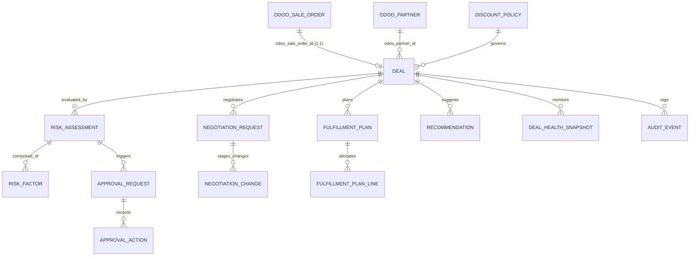

# DealFlow360 — Canonical Entity Relationship Diagram (ERD) & Data Dictionary

> **Author:** Person 1 (DB Architect)  
> **Role:** Owner of Canonical Data Model, Physical Schema, Invariants, Migrations, and Repositories.  
> **Core Principle:** *Odoo owns transactional truth. DealFlow owns decision state.*

---

## 1. High-Level Entity Relationship Diagram

---

## 2. Canonical Data Dictionary (13 Governance Entities)

### 1. `deal`
*Central intelligence entity representing a deal lifecycle mapped 1:1 to an Odoo Sales Order.*

| Column | Type | Constraints | Description |
| :--- | :--- | :--- | :--- |
| `id` | `UUID` | `PRIMARY KEY` | DealFlow unique identifier. |
| `odoo_sale_order_id` | `BIGINT` | `UNIQUE NOT NULL` | 1:1 Foreign reference to Odoo `sale.order(id)`. |
| `odoo_partner_id` | `BIGINT` | `NOT NULL` | Reference to Odoo customer `res.partner(id)`. |
| `owner_user_id` | `BIGINT` | `NOT NULL` | Sales rep user ID in Odoo `res.users(id)`. |
| `company_id` | `BIGINT` | `NOT NULL DEFAULT 1` | Multi-company boundary identifier. |
| `status` | `VARCHAR(32)` | `NOT NULL, CHECK` | `DRAFT`, `EVALUATED`, `PENDING_APPROVAL`, `APPROVED`, `NEGOTIATION`, `REAPPROVAL`, `READY`, `FULFILLING`, `BILLING`, `CLOSED`. |
| `approval_state` | `VARCHAR(32)` | `NOT NULL, CHECK` | `NONE`, `PENDING_MANAGER`, `PENDING_FINANCE`, `APPROVED`, `REJECTED`, `RETURNED`. |
| `health_status` | `VARCHAR(32)` | `NOT NULL, CHECK` | `HEALTHY`, `STALLED`, `AT_RISK`, `CRITICAL`. |
| `current_risk_score`| `DECIMAL(5,2)`| `CHECK [0, 100]` | Latest computed blended risk score. |
| `created_at` | `TIMESTAMPTZ`| `DEFAULT CURRENT_TIMESTAMP` | Record creation timestamp. |
| `updated_at` | `TIMESTAMPTZ`| `DEFAULT CURRENT_TIMESTAMP` | Last state transition timestamp. |

---

### 2. `discount_policy`
*Rules table defining discount limits, approval thresholds, and margin floors.*

| Column | Type | Constraints | Description |
| :--- | :--- | :--- | :--- |
| `id` | `UUID` | `PRIMARY KEY` | Policy UUID. |
| `name` | `VARCHAR(128)`| `NOT NULL` | Descriptive name (e.g. "Gold Tier Hardware"). |
| `customer_tier` | `VARCHAR(32)` | `CHECK` | `BRONZE`, `SILVER`, `GOLD`, `ALL`. |
| `product_category_id`| `BIGINT` | `NULLABLE` | Optional category scope (`product.category(id)`). |
| `max_discount_pct` | `DECIMAL(5,2)` | `CHECK [0, 100]` | Ceiling before approval is required. |
| `manager_threshold` | `DECIMAL(5,2)` | `CHECK [0, 100]` | Upper limit for Sales Manager approval. |
| `finance_threshold` | `DECIMAL(5,2)` | `CHECK [0, 100]` | Upper limit for Finance approval. |
| `minimum_margin_pct`| `DECIMAL(5,2)` | `CHECK [0, 100]` | Floor margin required for auto-approval. |
| `priority` | `INT` | `DEFAULT 10` | Precedence score for overlapping policies. |
| `active` | `BOOLEAN` | `DEFAULT TRUE` | Activation toggle. |
| `effective_from` | `DATE` | `NOT NULL` | Start date of policy validity. |
| `effective_to` | `DATE` | `NULLABLE` | Expiration date of policy validity. |

---

### 3. `risk_assessment` & `risk_factor`
*Explainable risk calculations itemizing every contributing factor.*

#### `risk_assessment`
| Column | Type | Constraints | Description |
| :--- | :--- | :--- | :--- |
| `id` | `UUID` | `PRIMARY KEY` | Assessment UUID. |
| `deal_id` | `UUID` | `FK -> deal(id)` | Target deal. |
| `risk_score` | `DECIMAL(5,2)` | `CHECK [0, 100]` | Final blended score. |
| `severity` | `VARCHAR(16)` | `CHECK` | `LOW`, `MEDIUM`, `HIGH`, `CRITICAL`. |
| `decision` | `VARCHAR(32)` | `CHECK` | `AUTO_APPROVED`, `MANAGER_APPROVAL`, `FINANCE_APPROVAL`, `REJECTED`. |
| `policy_version`| `VARCHAR(32)` | `DEFAULT 'v1.0'` | Historical algorithm/policy version. |

#### `risk_factor`
| Column | Type | Constraints | Description |
| :--- | :--- | :--- | :--- |
| `id` | `UUID` | `PRIMARY KEY` | Factor UUID. |
| `risk_assessment_id`| `UUID` | `FK -> risk_assessment(id)` | Parent assessment. |
| `factor_type` | `VARCHAR(64)` | `NOT NULL` | `DISCOUNT_EXCESS`, `MARGIN_PRESSURE`, `STOCK_SPLIT`, etc. |
| `raw_value` | `DECIMAL(10,2)`| `NOT NULL` | Raw metric value. |
| `weight` | `DECIMAL(5,2)` | `NOT NULL` | Multiplier weight. |
| `contribution` | `DECIMAL(5,2)` | `NOT NULL` | Contribution to total score. |
| `reason` | `TEXT` | `NOT NULL` | Human-readable explanation. |

---

### 4. `approval_request` & `approval_action`
*Multi-level approval workflow state machine and non-overwriting audit log.*

#### `approval_request`
- Enforces partial unique index: `UNIQUE (deal_id, sequence) WHERE status = 'PENDING'`.

#### `approval_action`
- Records every `APPROVED`, `REJECTED`, or `RETURNED` action with `actor_user_id`, reason, and timestamp.

---

### 5. `negotiation_request` & `negotiation_change`
*Customer portal counter-offer staging tables.*
- **Critical Isolation Rule:** Counter-offers submitted via the customer portal do NOT directly alter Odoo's `sale.order.line` table. Changes are staged here until evaluated by the governance engine and approved.

---

### 6. `fulfillment_plan` & `fulfillment_plan_line`
*Warehouse stock split optimizer tables.*
- Enforces **Invariant 1 (Quantity Conservation)**:
  $$\text{allocated\_qty} + \text{backorder\_qty} = \text{requested\_qty}$$

---

### 7. `recommendation`
*Upsell and cross-sell suggestions linked to products and expected margin deltas.*

---

### 8. `deal_health_snapshot`
*Point-in-time health metrics detecting stalled deals, discount anomalies, and delivery risks.*

---

### 9. `audit_event`
*Immutable, append-only system event ledger.*
- Records `before_state`, `after_state`, and JSONB `metadata` for complete historical auditability.

---

## 3. The 6 Critical Database Invariants

1. **Quantity Conservation:** `allocated_qty + backorder_qty = requested_qty` on all `fulfillment_plan_line` records.
2. **Score Bounds:** `risk_score`, `max_discount_pct`, and thresholds must be constrained to $[0.00, 100.00]$.
3. **Single Active Sequence:** Only one active approval request per deal sequence at any given time.
4. **Portal Isolation:** Odoo transactions cannot be mutated directly by external portal users without governance validation.
5. **Event Emission:** Every material state transition emits an immutable `audit_event`.
6. **Explicit Odoo References:** All foreign links to Odoo use explicit `odoo_*_id` naming conventions (`odoo_sale_order_id`, `odoo_partner_id`, etc.).
